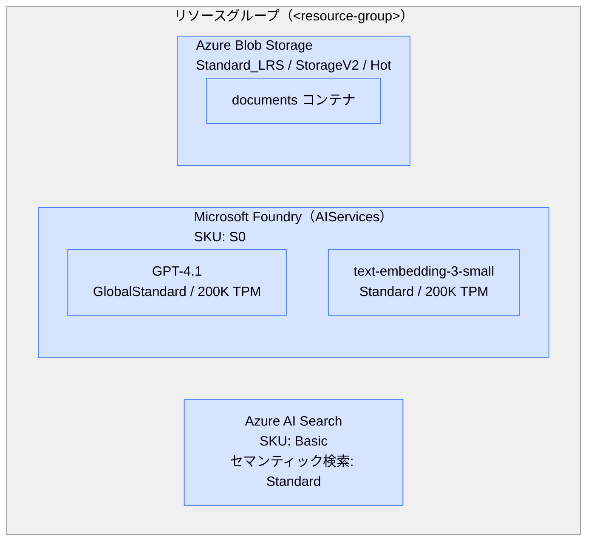

# 00 — 準備編

Azure リソースのデプロイを行います。

## 前提条件

- Azure CLI（`az login` 済み）
- Azure サブスクリプション（Contributor 権限）

## ユーザー設定値

以下の値をご自身の環境に合わせて決めてから、手順に進んでください。

| 変数 | 説明 | 例 |
|------|------|----|
| `<resource-group>` | リソースグループ名 | `rg-ragworkshop` |
| `<location>` | リソースグループのリージョン | `japaneast` |
| `<prefix>` | リソース名のプレフィックス（**グローバルで一意**）。プロジェクトを識別できる短い名前にしてください（英小文字・数字・ハイフン可、12 文字以内推奨） | `ragws24a` |
| `<foundry-location>` | Foundry（モデル）のリージョン。クォータ不足でデプロイに失敗する場合は別のリージョンを指定してください。[リージョン別提供状況](https://learn.microsoft.com/ja-jp/azure/ai-services/openai/concepts/models) | `japaneast` |

## 1. インフラデプロイ

```bash
# リソースグループ作成
az group create -n <resource-group> -l <location>

# デプロイ（ローカル開発用 RBAC 付き）
az deployment group create \
  -g <resource-group> \
  -f 00-setup/infra/main.bicep \
  -p prefix=<prefix> \
  -p foundryLocation=<foundry-location> \
  -p userPrincipalId=$(az ad signed-in-user show --query id -o tsv)
```

## 作成されるリソース



| リソース | SKU / 主要パラメータ | 用途 |
|----------|---------------------|------|
| Microsoft Foundry (AIServices) | S0 | GPT-4.1 / Embedding モデルのホスト |
| └ GPT-4.1 デプロイ | GlobalStandard / 200K TPM | チャットモデル |
| └ text-embedding-3-small デプロイ | Standard / 200K TPM | Embedding モデル |
| Azure AI Search | Basic（セマンティック検索: Standard） | ハイブリッド検索 + セマンティックリランカー |
| Azure Blob Storage | Standard_LRS / StorageV2 / Hot | ドキュメント保管 |

