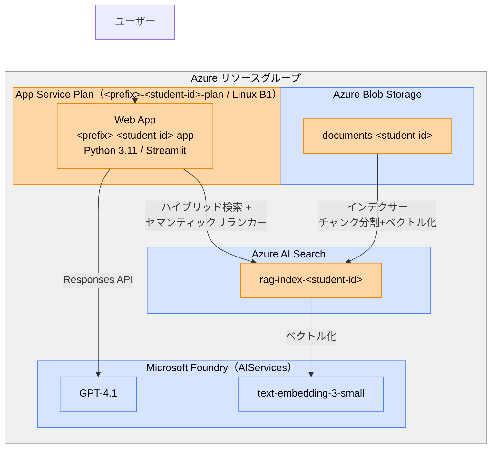
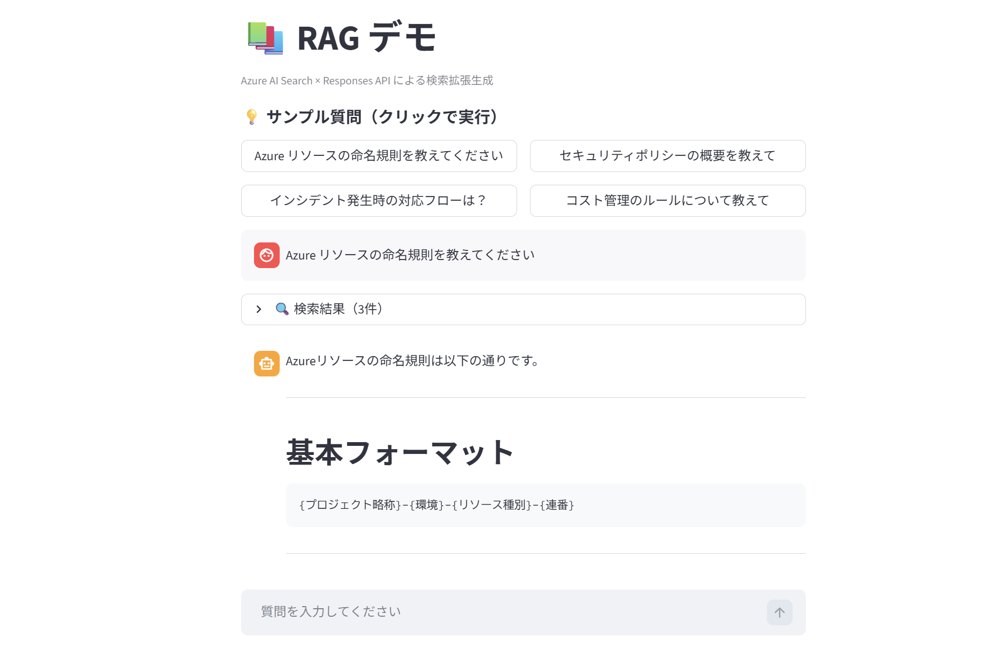

# 01 — 通常 RAG 編

Azure AI Search × Responses API による RAG（検索拡張生成）アプリを動かします。

## 構成



- 🔵 青 = 共有リソース（管理者がデプロイ）
- 🟠 オレンジ = 受講生ごとに作成

## 1. 認証の設定

本ワークショップでは API キーを使わず、すべて Microsoft Entra ID（`DefaultAzureCredential`）で認証します。

### ローカル開発

Azure CLI でログインしてください。

```bash
az login
```

管理者が各受講生に以下のロールを割り当てている必要があります。

| 対象リソース | ロール | 用途 |
|-------------|--------|------|
| Microsoft Foundry | Azure AI User | GPT-4.1 / Embedding API の呼び出し |
| Azure Blob Storage | Storage Blob Data Contributor | ドキュメントのアップロード |
| Azure AI Search | Search Service Contributor | インデックス・インデクサーの作成 |
| Azure AI Search | Search Index Data Contributor | インデックスデータの書き込み |

### Azure デプロイ

App Service にはシステム割り当てマネージド ID が自動で有効化され、デプロイスクリプトが以下のロールを割り当てます。

| 対象リソース | ロール | 用途 |
|-------------|--------|------|
| Microsoft Foundry | Azure AI User | Responses API の呼び出し |
| Azure AI Search | Search Index Data Reader | 検索クエリの実行 |

## 2. 環境変数の設定

リポジトリルートに `.env` ファイルを作成し、以下の値を設定してください。
インフラ共通の値は管理者から提供されます。`AZURE_SEARCH_INDEX` は **受講生ごとにユニークな値** を設定してください。

```bash
cp .env.sample .env
```

| 変数 | 説明 | 備考 |
|------|------|------|
| `AZURE_OPENAI_ENDPOINT` | Foundry の Azure OpenAI のエンドポイント | 管理者から提供 |
| `AZURE_OPENAI_MODEL` | チャットモデルのデプロイ名 | 管理者から提供 |
| `AZURE_OPENAI_EMBEDDING_MODEL` | Embedding モデルのデプロイ名 | 管理者から提供 |
| `AZURE_SEARCH_ENDPOINT` | AI Search のエンドポイント | 管理者から提供 |
| `AZURE_SEARCH_INDEX` | 検索インデックス名 | **受講生ごとにユニーク**（例: `rag-index-<student-id>`） |
| `AZURE_STORAGE_ACCOUNT_NAME` | Storage アカウント名 | 管理者から提供 |
| `AZURE_STORAGE_CONTAINER` | Blob コンテナ名 | **受講生ごとにユニーク**（例: `documents-<student-id>`） |
| `AZURE_SUBSCRIPTION_ID` | サブスクリプション ID | 管理者から提供 |
| `AZURE_RESOURCE_GROUP` | リソースグループ名 | 管理者から提供 |
| `PREFIX` | インフラのプレフィックス | 管理者から提供 |
| `STUDENT_ID` | 受講生の識別子 | **受講生ごとにユニーク**（例: `tk01`） |

## 2. インデックス作成

```bash
cd 01-rag/scripts
python -m venv .venv
source .venv/bin/activate
pip install -r requirements.txt

# ドキュメントをアップロード
python upload_docs.py

# AI Search インデックス作成
python create_index.py
```

## 3. ローカルで動かす

```bash
cd 01-rag/app
python -m venv .venv
source .venv/bin/activate
pip install -r requirements.txt

streamlit run app.py
```

## 4. Azure にデプロイする

`.env` の設定がすべて完了していれば、スクリプトを実行するだけでデプロイできます。

### Linux / macOS

```bash
bash 01-rag/deploy.sh
```

### Windows (PowerShell)

```powershell
.\01-rag\deploy.ps1
```

デプロイスクリプトは以下を実行します:

1. 受講生ごとの App Service Plan を作成（既存の場合はスキップ）
2. 受講生ごとの Web App `<prefix>-<student-id>-app` を作成
3. システム割り当てマネージド ID を有効化し、Foundry・AI Search への RBAC を割り当て
4. `.env` の設定値をアプリ設定に反映
5. アプリコードを zip デプロイ

### デプロイされるリソースの構成

| 項目 | 値 |
|------|-----|
| App Service Plan SKU | B1 (Basic, Linux) |
| ランタイム | Python 3.11 |
| Web App 名 | `<prefix>-<student-id>-app` |
| 認証 | システム割り当てマネージド ID |
| スタートアップ コマンド | `pip install -r app/requirements.txt && python -m streamlit run app/app.py --server.port 8000 --server.address 0.0.0.0` |

### マネージド ID に割り当てられる RBAC ロール

| 対象リソース | ロール |
|-------------|--------|
| Microsoft Foundry (`<prefix>-ai`) | Azure AI User |
| Azure AI Search (`<prefix>-search`) | Search Index Data Reader |

デプロイ完了後、`https://<prefix>-<student-id>-app.azurewebsites.net` でアクセスできます。

## 試してみる

サンプル質問をクリックするか、自由に質問を入力してみましょう。



- 「Azure リソースの命名規則を教えてください」
- 「セキュリティポリシーの概要を教えて」
- 「インシデント発生時の対応フローは？」