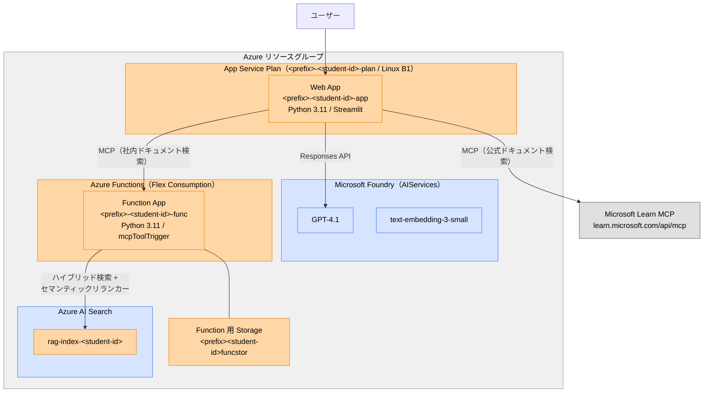

# 02 — MCP 編

01-rag のアプリを MCP（Model Context Protocol）対応に拡張し、Azure Functions で MCP サーバーをデプロイします。
社内ドキュメントと Microsoft 公式ドキュメントの両方を活用するエージェントパターンを体験します。

## 構成



- 🔵 青 = 共有リソース（管理者がデプロイ）
- 🟠 オレンジ = 受講生ごとに作成
- ⚪ グレー = 外部サービス

## 前提条件

- [00-setup](../00-setup/) と [01-rag](../01-rag/) が完了していること
- [Azure Functions Core Tools](https://learn.microsoft.com/azure/azure-functions/functions-run-local#install-the-azure-functions-core-tools) をインストールしていること

## 1. ローカルで動かす

### MCP サーバー（Azure Functions）を起動

```bash
cd 02-mcp/mcp
python -m venv .venv
source .venv/bin/activate
pip install -r requirements.txt

# ローカル実行用の設定ファイル local.settings.json を作成
cp --update=none local.settings.json.sample local.settings.json

# local.settings.json の AZURE_SEARCH_ENDPOINT / AZURE_SEARCH_INDEX を設定
# (.env に記載の値を流用)

func start
```

### Streamlit アプリを起動

MCP サーバー（`func start`）は起動したままにしておき、**別のターミナル**を開いて以下を実行してください。

```bash
cd 02-mcp/app
python -m venv .venv
source .venv/bin/activate
pip install -r requirements.txt

streamlit run app.py
```

サイドバーで「AI エージェント + MCP」を選択してください。

## 2. Azure にデプロイする

`.env` の設定がすべて完了していれば、スクリプトを実行するだけでデプロイできます。

### Linux / macOS

```bash
bash 02-mcp/deploy.sh
```

### Windows (PowerShell)

```powershell
.\02-mcp\deploy.ps1
```

デプロイスクリプトは以下を実行します:

1. 受講生ごとの Function 用 Storage Account とデプロイパッケージ用コンテナを作成
2. 受講生ごとの Function App `<prefix>-<student-id>-func` を Flex Consumption で作成
3. Function App のシステム割り当てマネージド ID を有効化し、AI Search・Function 用 Storage への RBAC を割り当て
4. MCP サーバーコードを Function App にデプロイ
5. 受講生ごとの App Service Plan / Web App を作成（01-rag で作成済みの場合はスキップ）
6. Web App のマネージド ID を有効化し、Foundry・AI Search への RBAC を割り当て
7. `.env` の設定値と `MCP_SERVER_URL`（Function App の MCP エンドポイント）を Web App のアプリ設定に反映
8. アプリコードを MCP 対応版に zip デプロイ（01-rag のアプリを上書き）

### デプロイされるリソースの構成

| リソース種別 | リソース名 | 備考 |
|------|-----|------|
| App Service Plan（Web App 用） | `<prefix>-<student-id>-plan` | 01-rag で作成済みのものを流用（Linux B1） |
| Web App | `<prefix>-<student-id>-app` | 01-rag のアプリを MCP 対応版で上書き |
| App Service Plan（Function 用） | `ASP-<resource-group>-<ランダム>` | Flex Consumption 用に Azure CLI が自動作成 |
| Function App | `<prefix>-<student-id>-func` | MCP サーバー（Flex Consumption） |
| Storage Account | `<prefix><student-id>funcstor` | Function App のランタイム・デプロイパッケージ用 |

### Web App / Function App の主な設定

| 項目 | 値 |
|------|-----|
| Web App ランタイム | Python 3.11 |
| Web App スタートアップ コマンド | `pip install -r app/requirements.txt && python -m streamlit run app/app.py --server.port 8000 --server.address 0.0.0.0` |
| Function App SKU | Flex Consumption (FC1, Linux) |
| Function App ランタイム | Python 3.11 |
| Function トリガー | `mcpToolTrigger` |
| 認証 | システム割り当てマネージド ID |

### マネージド ID に割り当てられる RBAC ロール

| 主体 | 対象リソース | ロール |
|------|-------------|--------|
| Function App | Azure AI Search (`<prefix>-search`) | Search Index Data Reader |
| Function App | Function 用 Storage | Storage Blob Data Owner |
| Web App | Microsoft Foundry (`<prefix>-ai`) | Azure AI User |
| Web App | Azure AI Search (`<prefix>-search`) | Search Index Data Reader |

デプロイ完了後、`https://<prefix>-<student-id>-app.azurewebsites.net` でアクセスできます。

## MCP サーバー一覧

| MCP サーバー | 用途 | エンドポイント |
|---|---|---|
| Azure Functions（自作） | 社内ドキュメント検索 | `http://localhost:7071/runtime/webhooks/mcp/mcp`（ローカル） |
| Microsoft Learn（外部） | 公式ドキュメント検索 | `https://learn.microsoft.com/api/mcp` |

## 試してみる

サイドバーで「AI エージェント + MCP」を選択してから質問してみましょう。

- 「社内の Azure 命名規則を教えて」（社内ドキュメント検索）
- 「Azure Functions の Python でのデプロイ方法は？」（公式ドキュメント検索）
- 「社内のセキュリティポリシーと Azure のベストプラクティスを比較して」（両方を横断）
