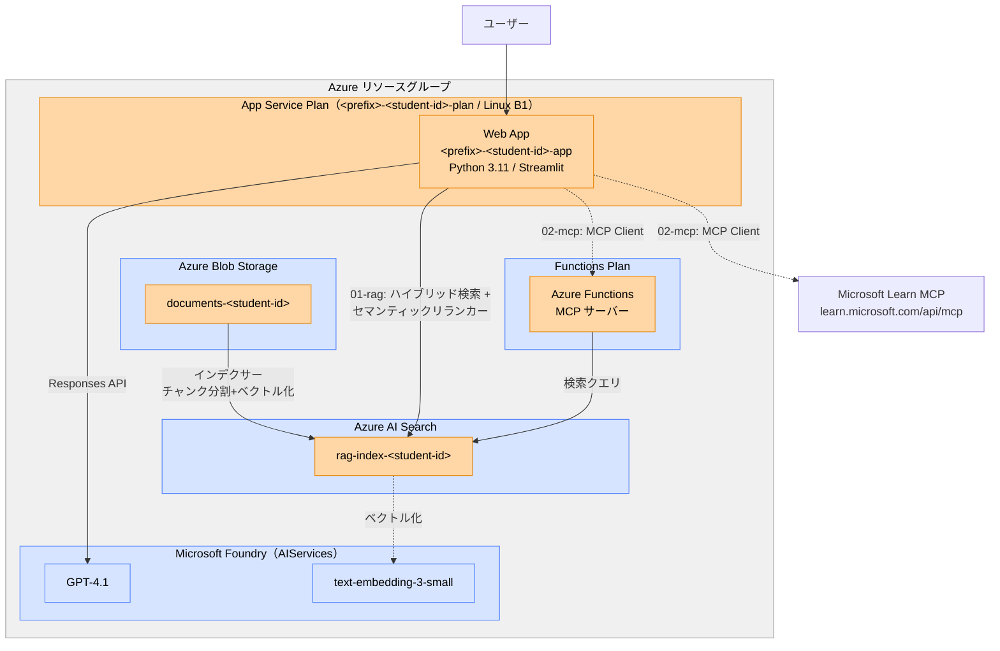

# RAG + MCP Workshop

Azure AI Search × Responses API による RAG 構成と、MCP（Model Context Protocol）を使った AI エージェントパターンのハンズオンです。

## ワークショップの流れ

| # | フォルダ | 対象者 | 内容 |
|---|---------|--------|------|
| 0 | [00-setup](./00-setup/) | 管理者 | **準備編** — Azure 共有リソースのデプロイ |
| 1 | [01-rag](./01-rag/) | 受講生 | **通常 RAG 編** — インデックス作成、RAG アプリの起動・デプロイ |
| 2 | [02-mcp](./02-mcp/) | 受講生 | **MCP 編** — アプリを MCP 対応に更新、Azure Functions で MCP サーバーをデプロイ |

## リソース構成

- 🔵 青 = 共有リソース（管理者が 00-setup でデプロイ）
- 🟠 オレンジ = 受講生ごとに作成（`.env` の `STUDENT_ID` で分離）

## 前提条件

- Python 3.11+
- Azure CLI（`az login` 済み）
- Azure サブスクリプション（Contributor 権限）
- Azure Functions Core Tools v4+（MCP 編で使用）

## 認証

`DefaultAzureCredential` を使用（API キー不要）:

| 環境 | 認証方式 |
|------|----------|
| ローカル開発 | `az login` の資格情報 |
| Azure App Service | システム割り当てマネージド ID |
| Azure Functions | システム割り当てマネージド ID |
